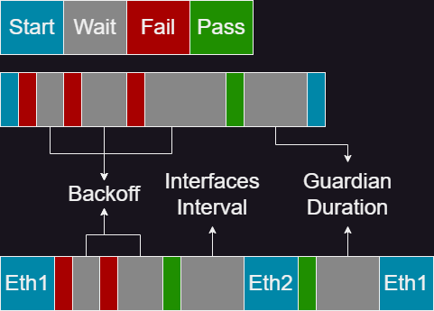

# BitSrunLoginGo

[](https://github.com/Mmx233/BitSrunLoginGo/blob/main/LICENSE)
[](https://github.com/Mmx233/BitSrunLoginGo/releases)
[](https://goreportcard.com/report/github.com/Mmx233/BitSrunLoginGo)
[](https://hub.docker.com/repository/docker/mmx233/bitsrunlogin-go)

深澜校园网登录脚本 Go 语言版。GO 语言可以直接交叉编译出 mips 架构可执行程序（路由器）（主流平台更不用说了），从而免除安装环境。

> 主要登录逻辑来自： https://github.com/coffeehat/BIT-srun-login-script

Openwrt 可以参考 [immortalwrt/packages/net/bitsrunlogin-go](https://github.com/immortalwrt/packages/tree/master/net/bitsrunlogin-go) 添加构建配置文件。单独复制文件夹、添加源或直接使用 [immortalwrt](https://github.com/immx233/immortalwrt) 编译固件，选择 application / [luci-app-bitsrunlogin-go](https://github.com/immortalwrt/luci/tree/master/applications/luci-app-bitsrunlogin-go)

## :gear:运行

编译结果为可执行文件，下载 release 或编译后直接运行即可。如果你不知道 `windows_amd64_v4` 中的 `v4` 或 `linux_arm_hardfloat` 中的 `hardfloat` 意味着什么，选取没有这些后缀的有更高兼容性的默认版本即可

首次运行将自动生成配置文件，首次使用建议开启调试日志（`settings.log.debug_level` 设为 `true` 或使用 flag `--debug`），可以通过添加启动参数 `--config` 指定配置文件路径，默认为当前目录的 `Config.yaml`

配置类型支持 `json`、`yaml`，默认使用 `yaml`

```shell
./bitsrun --config=./another-config.yaml
./bitsrun --config=/demo/i.json
```

其他 flags:

```text
--debug             #临时开启 debug 模式
--auto-acid         #自动嗅探 acid
--acid 7            #覆写配置文件 acid 值
--auto-enc          #自动嗅探 enc
```

Config.yaml 说明：

```yaml
accounts: # 账号列表，支持多账号同时登录
  - username: "" # 账号
    password: "" # 密码
    user_type: cmcc # 运营商类型，详情看下方文字说明
    net_iface: "" # 可选：绑定到指定网卡，如 "eth0"。留空则不绑定。仅在 Linux 系统下生效。
meta: # 登录参数
  "n": "200"
  type: "1"
  acid: "5"
  enc: srun_bx1 # enc 不在表单中，但一般都是默认值。你可以使用 --auto-enc 或在 js 中搜索 enc 来找到真实值
  os: Windows 10
  name: windows
  info_prefix: SRBX1 # info 字段前缀括号中的值
  double_stack: false
settings:
  basic: # 基础设置
    https: false # 访问校园网 API 时使用 https 协议
    skip_cert_verify: false # 跳过证书有效校验
    timeout: 5 # 网络请求超时时间（秒，正整数）
    domain: www.msftconnecttest.com # 登录地址 ip 或域名
  guardian: # 守护模式（后台常驻）
    enable: false
    duration: 300 # 网络检查周期（秒，正整数）
  backoff: # 积分/指数退避
    enable: false # 开启后同时对所有运行模式生效，作用于登录失败的重试
    max_retries: 0 # 为 0 时无限重试直至成功
    initial_duration: 2 # 初始失败等待时间，秒
    max_duration: 300 # 最大失败等待时间，秒
    # 等待时间计算公式详见 https://github.com/Mmx233/BackoffCli
    exponent_factor: 1 # 指数因子
    inter_const_factor: 0 # 内常数因子，秒
    outer_const_factor: 0 # 外常数因子，秒
  log:
    debug_level: false # 打印调试日志
    write_file: false # 写日志文件
    log_path: ./ # 日志文件存放目录路径
    log_name: "" # 指定日志文件名
  ddns: # 校园网内网 ip ddns
    enable: false
    domain: www.example.com
    ttl: 600
    provider: "cloudflare"
    config: # 这段配置是动态的，需要根据 provider 类型配置字段名，见 DDNS 说明
      zone: "xxxx"
      token: "xxxx"
  reality: # 从指定地址模拟浏览器行为进入登录页，如果登录未出现问题不用启用
    enable: false
    addr: http://www.baidu.com # 初始地址，需要使用 http、域名
  custom_header: # 这段配置是动态的，用于设置请求头，可以自由填写
    User-Agent: Mozilla/5.0 (Windows NT 10.0; Win64; x64; rv:89.0) Gecko/20100101 Firefox/89.0
  webhook: # Webhook 配置
    enable: false
    url: ""
    timeout: 30
```

登录参数从原网页登陆时对 `/srun_portal` 的请求抓取，抓取时请把浏览器控制台的 `preserve log`（保留日志）启用。

运营商类型在原网页会被自动附加在账号后，请把 `@` 后面的部分填入 `user_type`，没有则留空（删掉默认的）

## :minidisc: 运行时间线



## :bow_and_arrow: DDNS

将 `ddns.enable` 设为 `true` 后，将在登录成功时以及守护模式（Guardian）下启动首次检测到已在线时设置指定域名的解析地址（A 记录），用于校园网内网通信。此功能的优点在于可以无视 Nat，即你可以在局域网的任何位置完成 DDNS 更新而不需要占用路由器资源。这在无法更换路由器系统时格外有用

支持的 Provider 及其设置（将额外配置添加到配置文件 DDNS 配置内）：

| Provider | 额外配置项 |
| :----------: | :--------------------------------------: |
| cloudflare<br>(Recommended) | `zone` 区域 ID<br/>`token` API 令牌 |
| aliyun | `access_key_id`<br/>`access_key_secret` |
| dnspod | `secret_id`<br/>`secret_key` |

如果多网卡模式下使用 ddns 存在问题，可以为个别网卡创建额外的配置文件单独进行登录。此外，校园网内网通信并不是安全的，校方往往会对其施加监管

## :shower: 多拨

现在你可以通过在 `accounts` 配置中为每个账号指定 `net_iface` 字段来实现多拨。例如：

```yaml
accounts:
  - username: "user1"
    password: "password1"
    user_type: "cmcc"
    net_iface: "eth0"
  - username: "user2"
    password: "password2"
    user_type: "unicom"
    net_iface: "eth1"
```

请注意，`net_iface` 绑定功能仅在 Linux 系统下稳定生效，在其它系统中可能无法成功绑定。如果要在 windows 等系统寻求稳定的多拨效果，可以考虑使用系统层面的绑定。

少部分学校中在多拨中使用同一个账号时可能即使多拨成功，同一账号在同一个网关下的多个设备可能会共享带宽限制，这意味着多拨没有效果。

## :anchor: Docker / Kubernetes

镜像：`mmx233/bitsrunlogin-go`

支持架构：`linux/amd64` `linux/386` `linux/arm64` `linux/arm/v7` `linux/arm/v6` `linux/ppc64le` `linux/riscv64` `linux/s390x`

在集群中使用时建议使用固定 tag 而不是 latest 以锁定版本。你可以在 [Dockerhub](https://hub.docker.com/repository/docker/mmx233/bitsrunlogin-go) 找到现在最新的 Tag

直接使用：

配置文件挂载至 `/data/Config.yaml`，若需更改配置文件类型，可以使用覆写启动参数以指定自定义路径和后缀

```shell
docker run -v path_to_config:/data/Config.yaml mmx233/bitsrunlogin-go:latest
```

自行构建：

如果需要在其他系统或架构使用，可能需要更改构建层与底层镜像，目前使用的 alpine 并不支持 linux 之外的系统

```shell
git clone https://github.com/Mmx233/BitSrunLoginGo.git
cd BitSrunLoginGo
docker build . --file Dockerfile --tag mmx233/bitsrunlogin-go:latest
```

## :hammer_and_wrench:构建

请安装最新版 golang

```shell
#直接编译本系统可执行程序：
git clone https://github.com/Mmx233/BitSrunLoginGo.git
cd BitSrunLoginGo
go build ./cmd/bitsrun

#或者使用经过优化的构建命令：
go build -trimpath -ldflags "-s -w -extldflags '-static -fpic'" ./cmd/bitsrun
```

交叉编译（Linux -> Windows Binary）：

```shell
export CGO_ENABLED=0
export GOOS=windows #系统
export GOARCH=amd64 #架构
go build -trimpath -ldflags "-s -w -extldflags '-static -fpic'" ./cmd/bitsrun
```

交叉编译（Windows Powershell -> Linux Binary）：

```shell
$env:CGO_ENABLED=0
$env:GOOS='linux' #系统
$env:GOARCH='amd64' #架构
go build -trimpath -ldflags "-s -w -extldflags '-static -fpic'" ./cmd/bitsrun

#消除命令行窗口
go build -trimpath -ldflags "-s -w -extldflags '-static -fpic' -H windowsgui" ./cmd/bitsrun
```

## :jigsaw: 作为 module 使用

**\*本项目使用了 AGPL V3 许可证，请酌情引用**

示例：

```go
package main

import (
	"github.com/Mmx233/BitSrunLoginGo/pkg/srun"
)

func main() {
    //具体用法请查看 struct 注释
    client := srun.New(&srun.Conf{
        Https:  false,
        Client: nil,
        LoginInfo: srun.LoginInfo{
            Form: &srun.LoginForm{
                Domain:   "",
                Username: "",
                UserType: "",
                Password: "",
            },
            Meta: &srun.LoginMeta{
                N:    "",
                Type: "",
                Acid: "",
                Enc:  "",
            },
        },
    })

    online, ip, err := client.LoginStatus()
    if err != nil {
        panic(err)
    }
	
    if !online {
        err = client.DoLogin(ip)
        if err != nil {
            panic(err)
        }	
    }
}
```